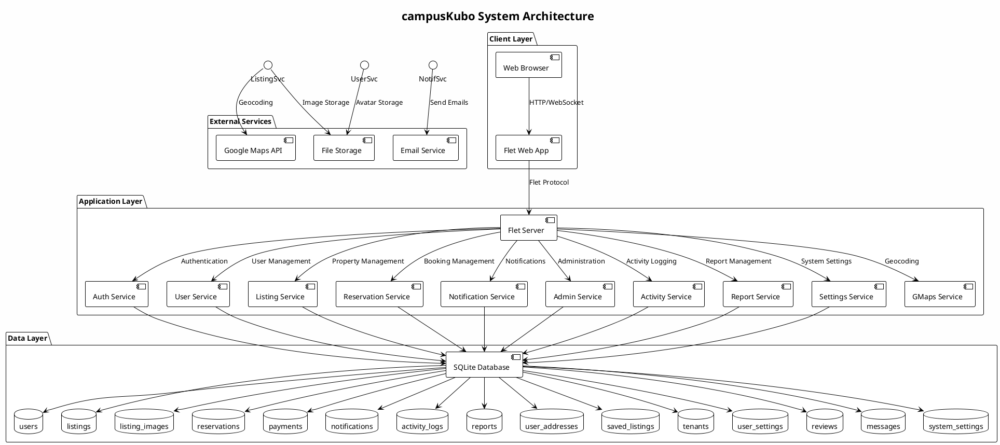
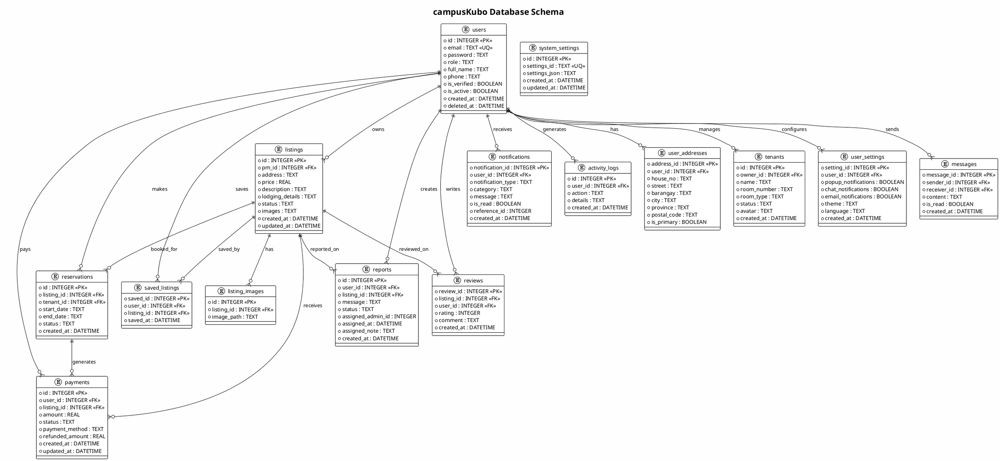

# Technical Documentation

## System Architecture Diagram



## Database Schema ERD



## Configuration & Environment Variable Reference

### Environment Variables

| Variable | Description | Default | Required |
|----------|-------------|---------|----------|
| `SECRET_KEY` | Application secret key | Generated | Yes |
| `DATABASE_URL` | Database connection URL | `sqlite:///campus_kubo.db` | No |
| `GOOGLE_MAPS_API_KEY` | Google Maps API key | None | No |
| `EMAIL_SERVER` | SMTP server | `smtp.gmail.com` | No |
| `EMAIL_PORT` | SMTP port | `587` | No |
| `EMAIL_USERNAME` | SMTP username | None | No |
| `EMAIL_PASSWORD` | SMTP password | None | No |
| `UPLOAD_FOLDER` | File upload directory | `app/storage/data/uploads` | No |
| `MAX_CONTENT_LENGTH` | Max upload size | `16MB` | No |
| `SESSION_TIMEOUT` | Session timeout minutes | `30` | No |

### Configuration Files

#### `config/colors.py`
Contains color scheme definitions for the UI:

```python
COLORS = {
    "primary": "#0078FF",
    "secondary": "#6C757D",
    "success": "#28A745",
    "danger": "#DC3545",
    "warning": "#FFC107",
    "info": "#17A2B8",
    "light": "#F8F9FA",
    "dark": "#343A40",
    "background": "#FFFFFF",
    "surface": "#F8F9FA",
    "text_dark": "#212529",
    "text_muted": "#6C757D",
    "border": "#DEE2E6"
}
```

#### `config/__init__.py`
Application configuration settings:

```python
class Config:
    SECRET_KEY = os.environ.get('SECRET_KEY') or 'dev-secret-key'
    DATABASE_URL = os.environ.get('DATABASE_URL') or 'sqlite:///campus_kubo.db'
    UPLOAD_FOLDER = os.path.join(os.path.dirname(__file__), '..', 'storage', 'data', 'uploads')
    MAX_CONTENT_LENGTH = 16 * 1024 * 1024  # 16MB
    SESSION_TIMEOUT = 30  # minutes
```

### API Keys Setup

1. **Google Maps API**:
   - Get API key from Google Cloud Console
   - Enable Maps JavaScript API and Geocoding API
   - Set `GOOGLE_MAPS_API_KEY` environment variable

2. **Email Service**:
   - Configure SMTP settings in environment variables
   - For Gmail: Enable 2FA and use App Passwords

### File Structure

```
config/
├── __init__.py      # Main configuration
├── colors.py        # UI color scheme
└── settings.py      # App settings model
```